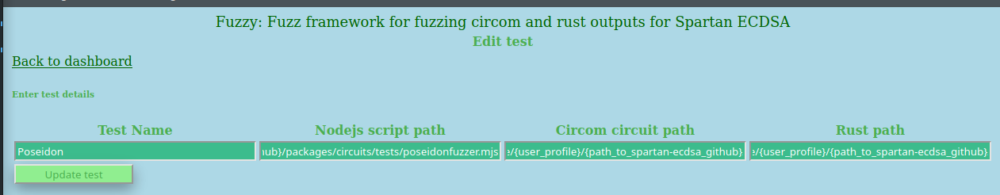

# Fuzzy is a fuzzing and sanity testing tool to fuzz and test code between Circom and Rust implementations.
Currently Fuzzy only supports the Poseidon hashing tests but could perhaps be extended

It consists of two components a `Flask` web admin panel and a python script for fuzzing which can be run from the command line.

and

The functionality of the Web admin panel, allows users, to :
- Create tests
- Edit tests
- Delete tests
- Add test data for tests
- View test results

## Add/Edit

## View tests runs by date

## View Test Results
This will show the actual outputs and if set can check if the outputs matched the expected output as set.

## Run a SQL script to add or alter bulk data.

## Fuzzing commandline
The command line allows for 3 commandline arguments:
- `test_id` to run
- `number_of_fuzz_runs` to specify how many times to run
- `add_results_to_db` to specify if the results should be added to the `Flask` app database 0 for `no` and 1 for `yes`

**The example below runs test number 1 for 3 runs and does not insert the results into the database**

## Fuzzing to match a predefined output value
Running the `fuzzymatch.py` script from the commandline allows you to test if it can generate random values to try and match the predefined value of : 46702443887670435486723478191273607819169644657419964658749776213559127696053. The script will stop should a match be generated.

The script works similar to the script above except it does not have an option to add the reults to the database.

Running the script will generate output as below:

## Installation:
**You would first need to clone and setup the Poseidon code you want to fuzz, this includes writing a Rust and a Javascript test file that can run with nodejs**

To run this `Flask` app it is suggested to install `venv`.

`git clone https://github.com/bbresearcher/Fuzzy && cd ./Fuzzy`

`python3 -m venv fuzzy`

Then run `source ./fuzzy/bin/activate`

Install `Flask` with `pip install flask`

Run the flask app with `python3 ./app.py`

## SETUP to run fuzzer with Spartan-ECDSA code [https://github.com/personaelabs/spartan-ecdsa](https://github.com/personaelabs/spartan-ecdsa)

Follow the Spartan-ECDSA github repo instructions to setup the environment and the run the tests.

Once the tests are working, place the two files in the `setup` directory in the following directories of the `spartan-ecdsa` folder structure.

- `setup/main.rs` : copy to  {spartan-ecdsa directory}/packages/poseidon/src/main.rs
- `setup/poseidonfuzzer.mjs` : copy to {spartan-ecdsa directory}/packages/circuits/tests/poseidonfuzzer.mjs

Now set up the `Poseidon` default test in the `Fuzzy` admin panel to have the following values (these are examples to guide what values are needed and can be changed if you would like to do so):
- Nodejs path : /home/{user_profile}/{path_to_spartan-ecdsa_github}/packages/circuits/tests/poseidonfuzzer.mjs
- Circom path : /home/{user_profile}/{path_to_spartan-ecdsa_github}/packages/circuits
- Rust path   : /home/{user_profile}/{path_to_spartan-ecdsa_github}/packages/poseidon/

`{user_profile}` and `{path_to_spartan-ecdsa_github}` must be the directories on your own computer where the code is stored

Setup as in the image below

## DISCLAIMER
This code is just an example used for my learning and SHOULD NOT BE USED IN A PRODUCTION environment. I do not warrant that it is bug free or fit for purpose.
